# Stand

De stand moet zo ontworpen zijn dat het het profiel op een bepaalde
afstand van de grond zal houden en stevig genoeg is om het geheel
stabiel te houden. Er is gekozen om dit te 3D printen zodat de
onderzoeker vrij is in het ontwerp en snel aanpassingen kan doen indien
nodig. Het eerste ontwerp was een rechthoek waar het profiel door past
met twee beentjes die naar de grond gaan voor stabiliteit. Na een eerste
revisie werd al snel besloten om de bovenste hoeken van de rechthoek af
te kappen omdat deze geen extra nut hebben en dit enkel maar langer
duurt om te printen.

## Stand 1 v1

In het eerste ontwerp is er gekeken naar de grootte van het profiel. Om
te zien dat de stand hier vlot kan inschuiven is er een marge van 0.2 mm
genomen. Het ging hier vooral over of de stand past en of dit stevig is.
Dit is ook maar met een breedte van 1 cm geprint om ervoor te zorgen dat
dit niet zolang moest printen.

\<iframe
src="https://myap83.autodesk360.com/shares/public/SH35dfcQT936092f0e43ae2769a1c0cda5d8?mode=embed"
width="1024" height="768" allowfullscreen="true"
webkitallowfullscreen="true" mozallowfullscreen="true"
frameborder="0"\>\</iframe\>

Figuur : Eerste prototype profielstand 1

## Stand 1 v2

De grootte van het gat waar het profiel in past was net iets te groot.
Om dit op te lossen is het gat in de breedte en de hoogte met 0.1mm
verkleind. Voor de rest is de stevigheid van de stand perfect. Hier moet
er niets meer aan worden aangepast.

Om ervoor te zorgen dat onze slider heen en weer kan bewegen wordt er
gebruik gemaakt van een rubberen ketting. Deze ketting wordt dan met een
pulley wheel met tanden (Afbeelding 3) strak gehouden. Deze pulley wordt
aan de stand vastgemaakt. Hiervoor wordt er een kleine rechthoek op de
stand gemaakt waar de pulley in past.

\<iframe
src="https://myap83.autodesk360.com/shares/public/SH35dfcQT936092f0e43b2dbe0e7d11261af?mode=embed"
width="1024" height="768" allowfullscreen="true"
webkitallowfullscreen="true" mozallowfullscreen="true"
frameborder="0"\>\</iframe\>

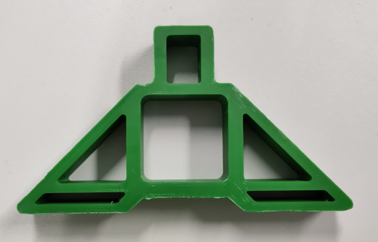

Figuur : Tweede prototype profielstand 1

## Stand 1 v3

Het rechthoek van de pulley is nog net iets te groot. Hierdoor kan de
pulley een beetje in de breedte bewegen. Er is een speling van 1.87mm.
De rechthoek wordt verkleind met 1mm in de breedte zodat de pulley
minder speling heeft. De hoogte van de stand wordt 2mm groter gemaakt
zodat het profiel iets hoger van de grond is. Als laatste waren de gaten
waar de bout doorgaat om de pulley vast te hangen niet op gelijke
hoogte. Dit was een verschil van 0.2mm wat niet zo groot is maar dit was
wel zichtbaar met het oog.

Om ervoor te zorgen dat de stand aan het profiel kan worden vastgemaakt
is er in het midden aan de onderkant een gat gemaakt waar een bout door
kan. Met een moer kan dit dan aan het profiel worden vatgemaakt.

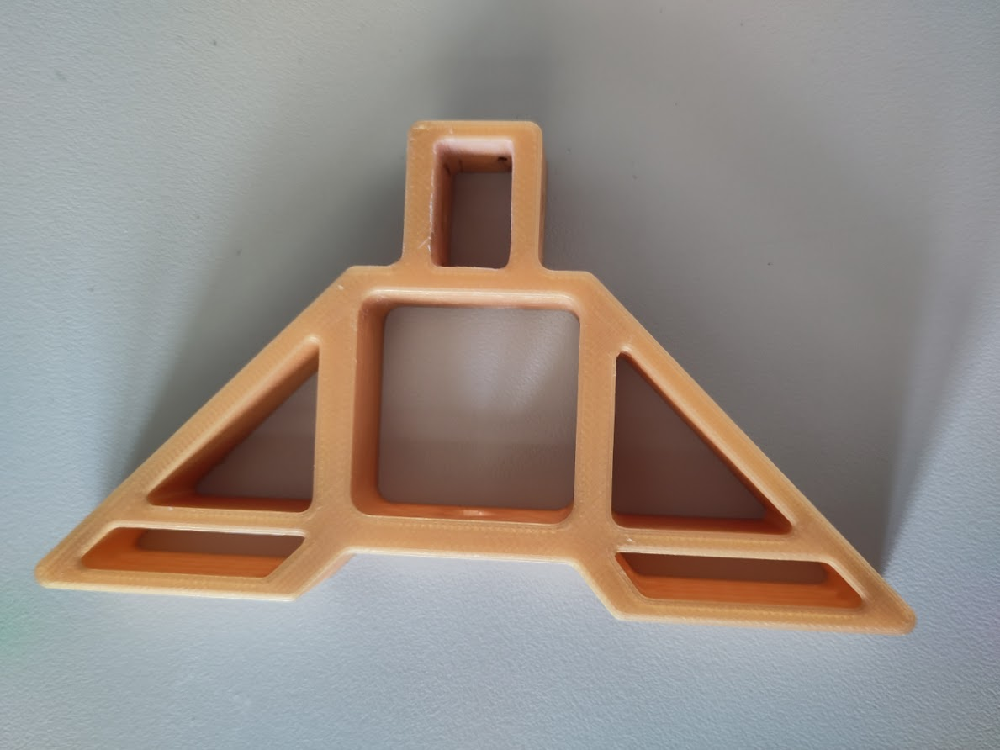

Figuur : Derde prototype profielstand 1

## Stand 2 v1

Stand 2 is de stand waar de stepper motor wordt aanvast gemaakt.
Hierdoor wordt het gewicht op de slider verlaagd. Om dit te ontwerpen
wordt er verder gebouwd op stand 1 v2. Het gat van de pulley wordt wat
vergroot omdat de pulley van aan de motor is groter. Daarnaast wordt er
een plateau gemaakt waar de stepper motor op kan staan. De steppermotor
wordt bevestigd aan twee pilaren die mee op het plateau staan.

\<iframe
src="https://myap83.autodesk360.com/shares/public/SH35dfcQT936092f0e43f48ecade61b5d065?mode=embed"
width="1024" height="768" allowfullscreen="true"
webkitallowfullscreen="true" mozallowfullscreen="true"
frameborder="0"\>\</iframe\>

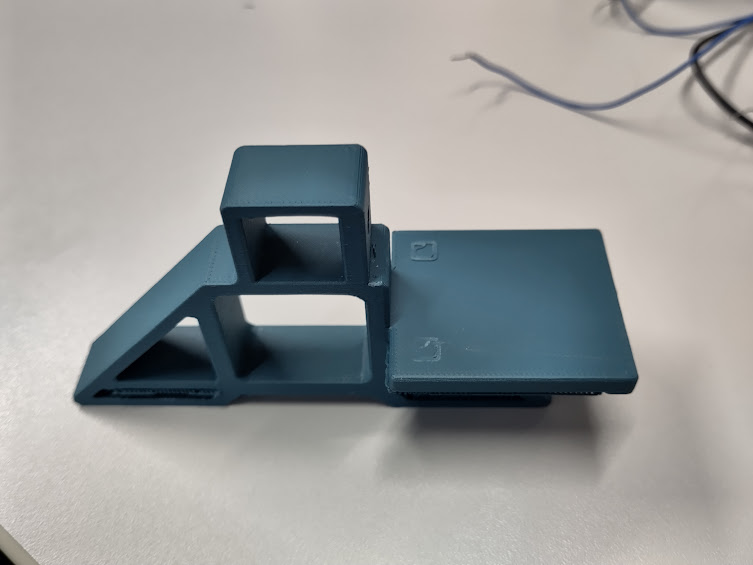

Figuur : Eerste prototype profielstand 2

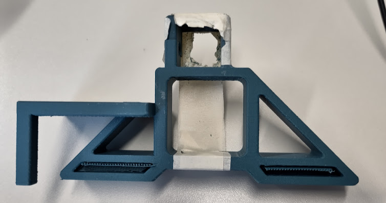

Figuur : Eerste prototype profielstand 2

## Stand 2 v2

Doordat het plateau breder is dan de stand, is de print richting 90
graden moeten draaien. Hierdoor was er veel support nodig. De infill was
ook maar 15% waardoor de pilaren van op het plateau niet stevig genoeg
waren. Om dit te verbeteren is er gekozen om een plaat te maken waarbij
er nog kan gekozen worden op welke plaats de stepper motor kan vast
gemaakt worden. Het plateau was nog iets te laag waardoor de stepper
motor wat zweefde.

Daarnaast is het gat waar de cilinder van de stepper motor doorgaat iets
te smal waardoor deze te veel wrijft tegen de kant wanneer de stepper
motor draait. Deze zal iets groter gemaakt moeten worden. De hoogte van
de stand wordt 2mm groter gemaakt zodat het profiel iets hoger van de
grond is.

Omdat versie 1 5u30 duurde om te printen en zeer veel support had, dit
is rechtopstaand geprint, is het printen 90 graden gedraaid waardoor dit
nog 4u30 was.

\<iframe
src="https://myap83.autodesk360.com/shares/public/SH35dfcQT936092f0e439ae8add0f062906b?mode=embed"
width="1024" height="768" allowfullscreen="true"
webkitallowfullscreen="true" mozallowfullscreen="true"
frameborder="0"\>\</iframe\>

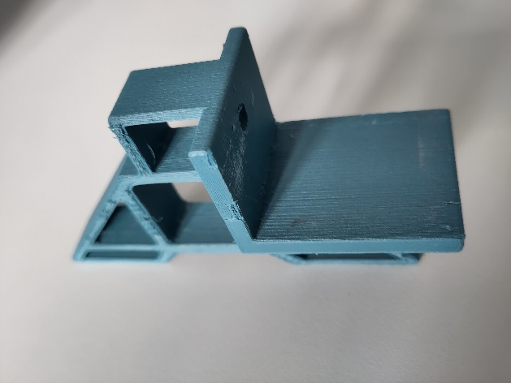

Figuur : Tweede prototype profielstand 2

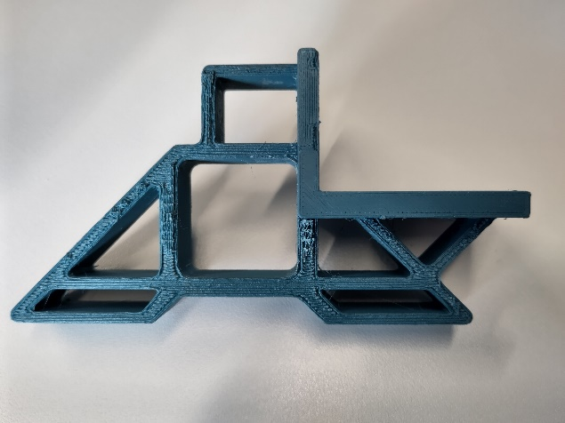

Figuur : Tweede prototype profielstand 2

## Stand 2 v3

De plaat waar de steppermotor aan zal worden vastgemaakt was iets te
klein waardoor de bovenste schroef gaten niet in de plaat konden worden
vastgemaakt. Deze is 1cm hoger gemaakt zodat de bovenste gaten van de
stepperdriver ook konden worden vastgemaakt aan de plaat. Door een model
in te laden van de steppermotor zijn de gaten waarmee de steppermotor
wordt vastgemaakt aan de plaat exact kunnen worden gemaakt. Hierdoor
moeten deze niet achteraf worden gemaakt met onnauwkeurigheden tot
gevolg.

Ondanks dat er al 1u van de print tijd is afgegaan was dit nog zeer lang
om te printen. Na even na te denken hoe we dit nog korter konden maken
is er beslist om de gehele structuur, exclusief het plateau waar de
steppermotor opstaat en de plaat waar deze wordt aanvast gemaakt, te
verschuiven naar de buitenkant zodat deze support al weg valt. Dit heeft
ons nog eens 1u10 gespaard.

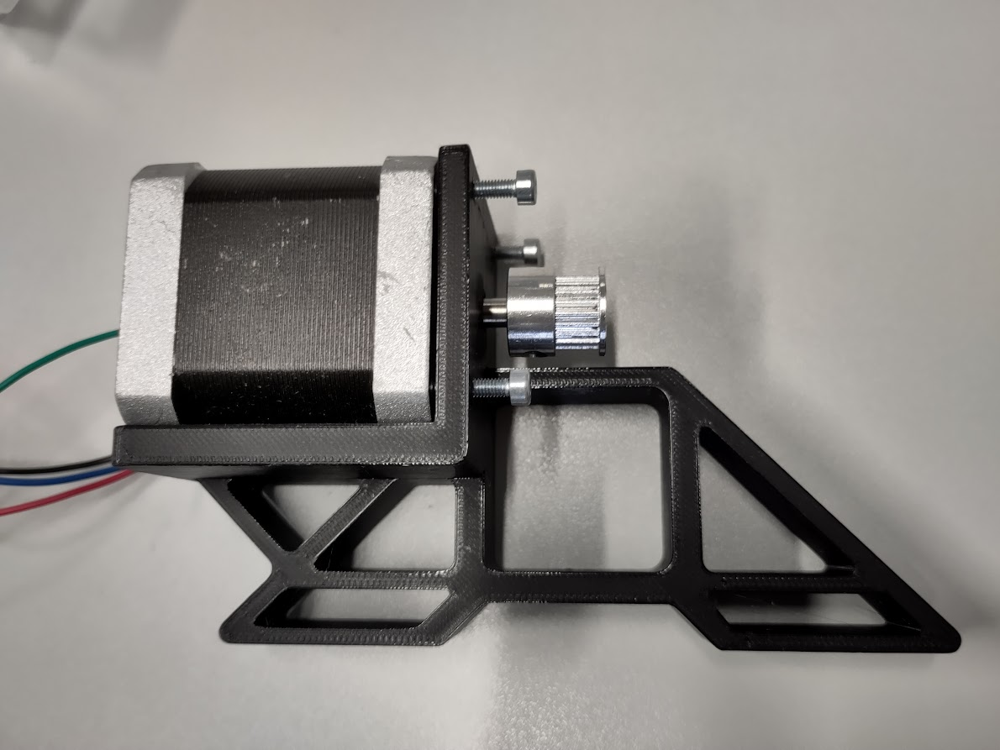

Figuur : Derde prototype profielstand 2

# Pan en Tilt Systeem

# Camera

De camera die worden gebruikt bij de camera slider is de ESP-Cam. Het is
klein en compact module. De kwaliteit van de camera is voldoende voor
huidige toepasing. Het gebruikt ook niet zo veel energie. Dat is perfect
want het systeem werkt op een batterij.

Voor het maken van een pan en tilt systeem. Heb je twee motoren nodig
een voor pan en andere voor de tilt. Er zijn verschilden motoren die,
kan gebruikt worden bij de systeem. Voor de systeem is er nood aan
lichte en compacte motor die ook sterk genoeg is om de ESP-Cam te laten
bewegen.

Daarom is er gekozen voor servo motor’s. Hier is de reden waarom dat
gekozen is:

- Ze zijn klein

- Hebben genoeg kracht om de ESP-Cam te laten bewegen

- Makkelijk te programmeren

- Heeft niet zoveel vermogen nodig.

- Heeft geen driver nodig kun je met ESP-Cam besturen

# 3D Model voor Pan en Tilt

Om de Pan en Tilt motor te laten werken heb je een behuizing nodig, om
camera te plaatsen en dat rond te bewegen. Daarom is er gekozen om een
3D model te zoeken of internet. Hier onder vindt u de foto van het
model. Die bij de systeem wordt gebruikt.

Hier onder vindt u foto’s van het 3D model:

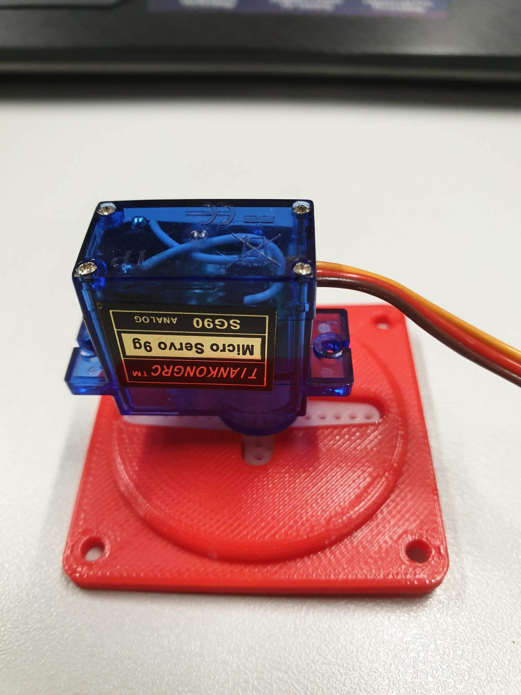

Figuur : Pan 3D model met servo

Figuur : Tilt 3D model met servo

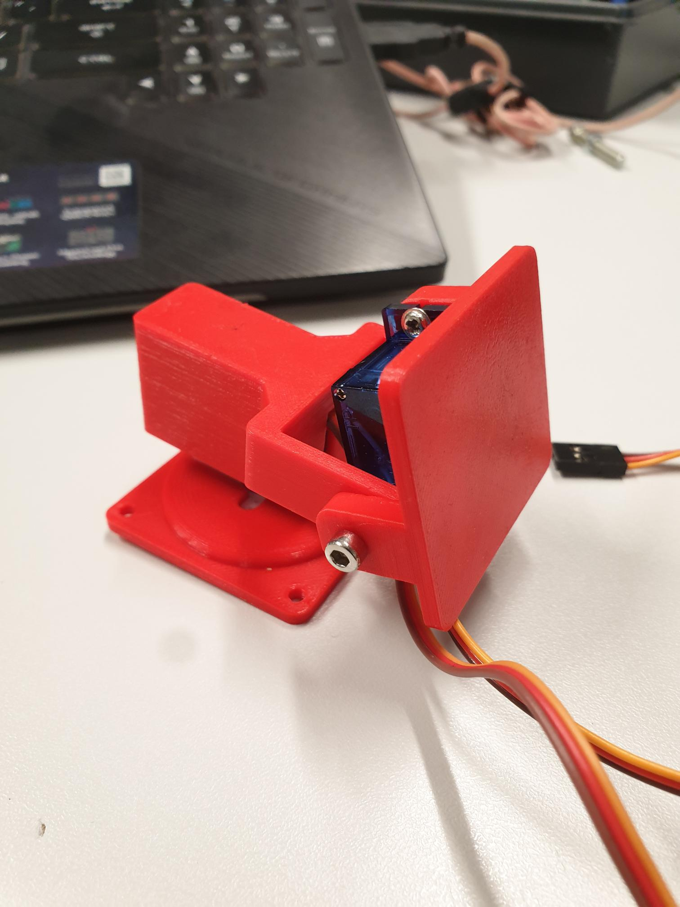

Figuur : Gemonteerd3D model

# Web interface

Bij normale omstandigheden gaat de camera slider alles automatische
doen. Maar om dat de doen heb je een interface nodig om te controleren.
Daarom is er een Node-Red interface gemaakt waar je de Pan en Tilt
systeem kan manueel kan controleren. Als de camera niet de juiste beeld
heeft. Je kunt bij de interface ook zien, wat je camera ziet zo dat weet
dat het correct is. Anders kun je altijd corrigeren met de interface.

De interface heeft twee slider een is voor de pan en de andere is voor
de tilt. Er twee modus om foto te nemen met en zonder flits. Afhankelijk
van de situatie kun je een van de twee modus kiezen. Hier onder ziet u
een voorbeeld van de interface.

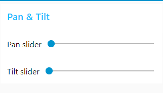

Figuur : Interface Pan en Tilt:

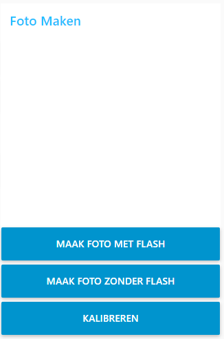

Figuur : Interface van ESP-Cam

# Elektrische schema

Om de ESP-Cam te makkelijk monteren is er een shield gemaakt. Bij deze
schema is er een pinout voor de servo’s. Er zijn ook program pinnen om
met ESP-Cam te communiceren.

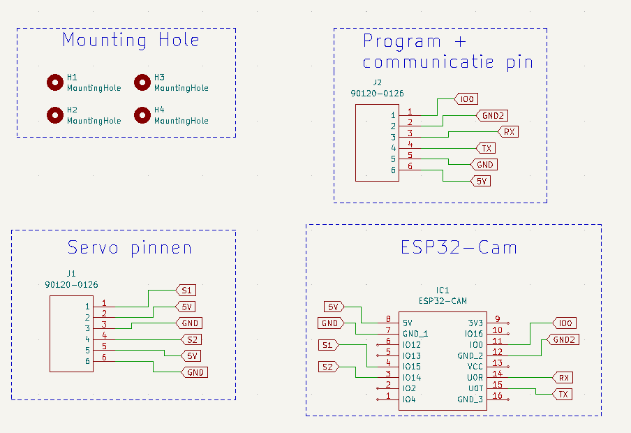

Figuur : Elektrische schema

# PCB

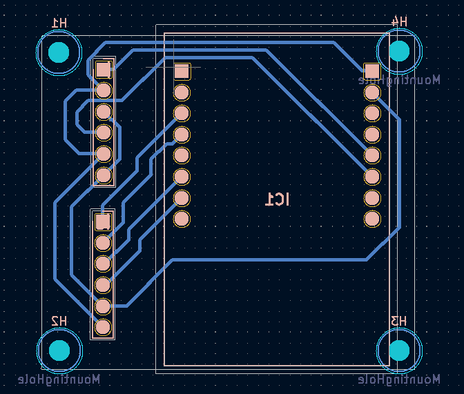

Figuur : PCB Schema

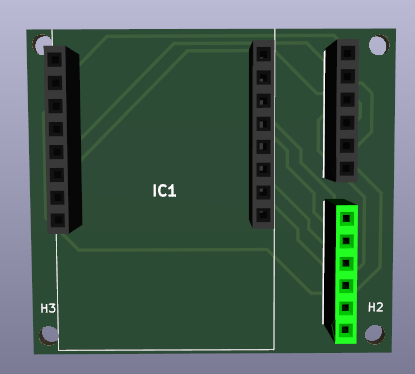

Figuur : PCB 3D model

# Gefreesde PCB’s

## Versie 1:

Bij versie 1 was de frees machine niet zo goed gekalibreerd waar door
die door de paden ging frezen.

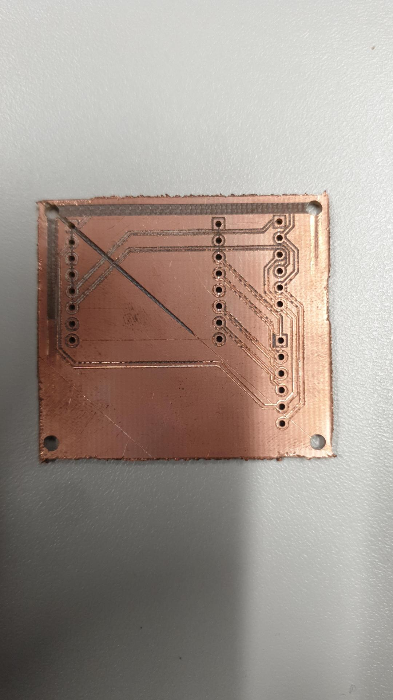

## Versie 2:

Bij versie 2 waren de paden niet zo goed gefreesd waar door er
kortsluiting zijn.

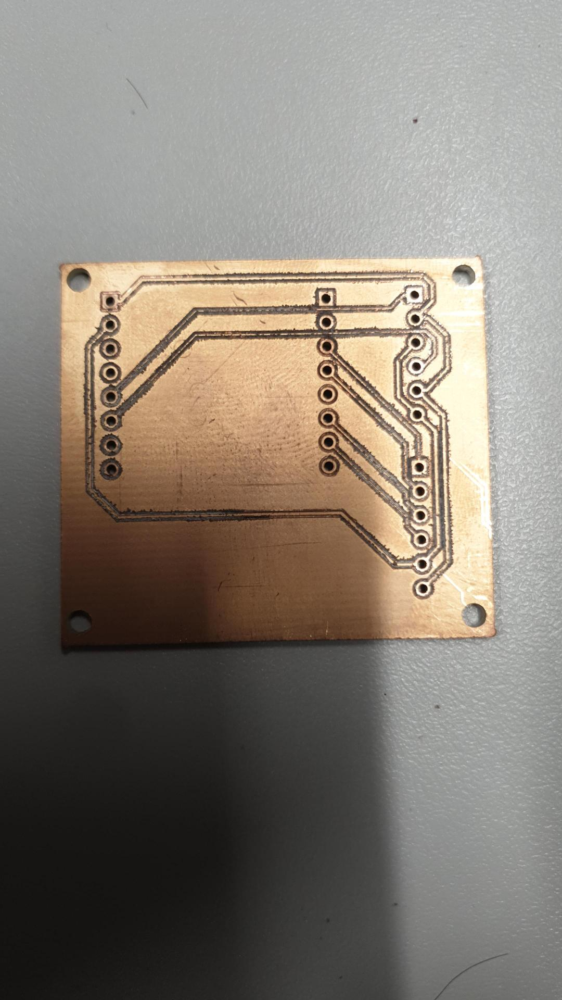

## Versie 3:

Bij versie 3 was de top en bottom omgewisseld waar door de camera pinnen
omgekeerd waren.

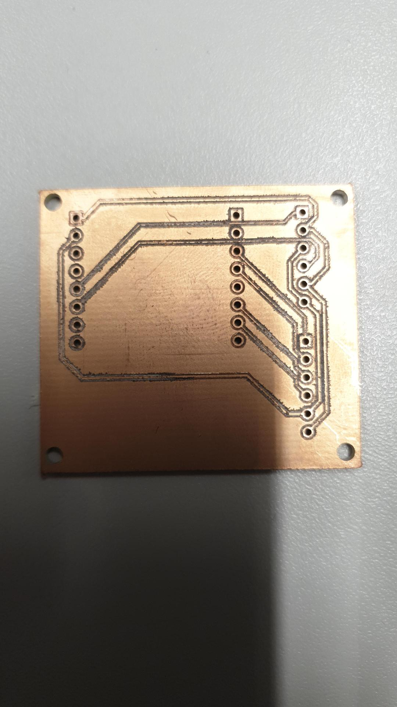

# Blokdiagram

Hier onderstaat staat in een block diagram wat er al gemaakt is in groen
gekleurd en wat er nog gemaakt moet worden in het rood gekleurd.

# Docker

Installeren van Docker via de site:
<https://docs.docker.com/desktop/install/windows-install/>. Zien dat je
een linux kernel hebt op je Windows machine om de WSL 2 versie als
default te zetten. Stappen 4 en 5 uitvoeren. Anders krijg je volgende
error bij het opstarten.

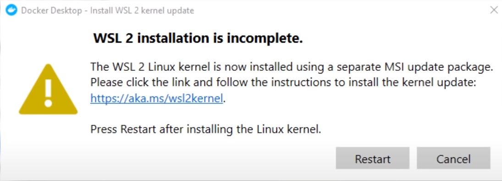

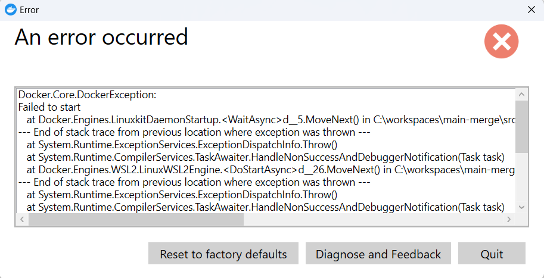

[Manual installation steps for older versions of WSL \| Microsoft
Learn](https://learn.microsoft.com/en-gb/windows/wsl/install-manual#step-4---download-the-linux-kernel-update-package)

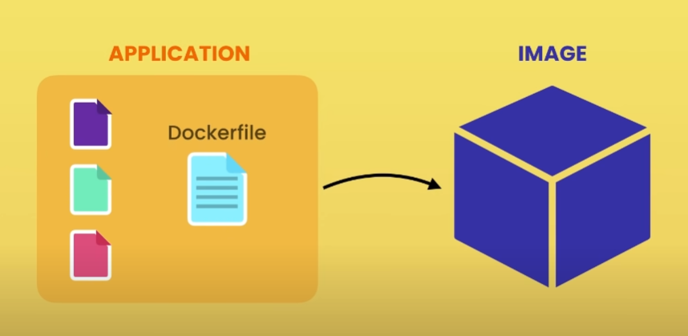

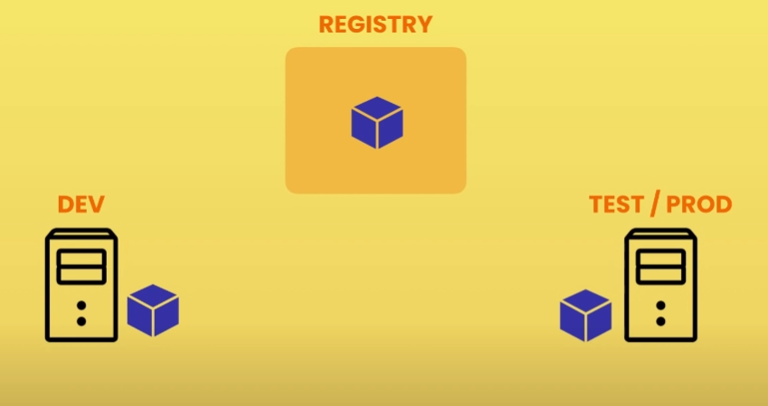

# Bronvermelding

Thingiverse.com. (2015, 4 maart). Mini Pan Tilt - Servo G9 by fbuenonet.
Geraadpleegd op 27 september 2022, van
https://www.thingiverse.com/thing:708819

<https://www.ibm.com/cloud/learn/docker>

<https://docs.docker.com/desktop/use-desktop/>
